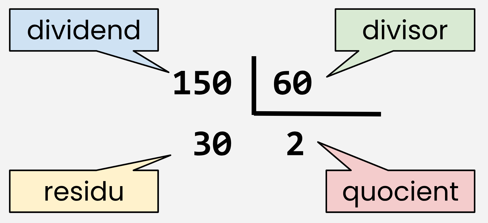

<link rel="stylesheet"
        href="https://cdnjs.cloudflare.com/ajax/libs/highlight.js/10.0.3/styles/default.min.css">
  <script src="https://cdnjs.cloudflare.com/ajax/libs/highlight.js/10.0.3/highlight.min.js"></script>
  <script>hljs.initHighlightingOnLoad();</script>


# Enunciats Seqüencials

## **5** *Càlcul Hipotenusa*

**Enunciat**: Donats els catets d'un triangle rectangle, calcular la seva hipotenusa.


**Nom del fitxer**: **```_05_calculHipotenusa.py```**

**Solució**: [**```_05_calculHipotenusa.py```**](./fitxers/_05_calculHipotenusa.py)

<details><summary>Mostra solució: _05_calculHipotenusa.py</summary>

<pre><code class="python">

from math import sqrt

if __name__ == '__main__':
# Definició de variables
    catet1 = float()
    catet2 = float()
    hipotenusa = float()

# Inicialització de variables
    print('Entra el primer dels catets: ', end='')
    catet1 = float(input())

    print('Entra el segon dels catets: ', end='')
    catet2 = float(input())

    hipotenusa = sqrt(catet1**2 + catet2**2 )
    # hipotenusa = sqrt(pow(catet1,2) + pow(catet2,2))

    print(f"La hipotenusa del triangle amb els catets de {catet1} i de {catet2} és {hipotenusa}.")
```
</code></pre>
</details>

<hr>

## **6** Calcul perimetre i àrea del rectangle

**Enunciat**: Calcular el perímetre i àrea d'un rectangle donada la seva base i la seva altura.

**Nom del fitxer**: **```_06_calculPeriAreaRectangle.py```**

**Solució**: [**```_06_calculPeriAreaRectangle.py```**](./fitxers/_06_calculPeriAreaRectangle.py)

<details><summary>Mostra solució: _06_calculPeriAreaRectangle.py</summary>

```python
if __name__ == '__main__':

# Definició de variables
    base = float()
    alcada = float()
    area = float()
    perimetre = float()

# Inicialització de variables

    print('Entra la base del rectangle: ', end='')
    base = float(input())

    print("Entra l'alçada del rectangle: ", end="")
    alcada = float(input())

    area = (base * alcada)
    perimetre = (2 * (base + alcada))

    print(f"L'area d'un rectangle de base {base} i alçada {alcada} és {area}")
    print(f"El perímetre d'un rectangle de base {base} i alçada {alcada} és {perimetre}")
```
</details>

<hr>

## **7** Demanar nom i saludar al usuari

**Enunciat**: Escriure un programa que demani a l'usuari el seu nom, i després el saludi.

**Nom del fitxer**: **```_07_demanarNomUsuariISaludar.py```**

**Solució**: [**```_07_demanarNomUsuariISaludar.py```**](./fitxers/_07_demanarNomUsuariISaludar.py)

<hr>

## **8** Totes les operacions amb dos nombres

**Enunciat**: A partir de dos nombres, mostrar la suma, la resta, el producte i la divisió dels dos nombres.

**Nom del fitxer**: **```_08_totesLesOperacionsAmbDosNombres.py```**

**Solució**: [**```_08_totesLesOperacionsAmbDosNombres.py```**](./fitxers/_08_totesLesOperacionsAmbDosNombres.py)

<hr>

## **9** Convertir de graus Fahrenheit a graus Celsius

**Enunciat**: Escriure un programa que converteixi un valor rebut en graus Fahrenheit a graus Celsius.

**Nom del fitxer**: **```_09_convertirDeFahrenheitACelsius.py```**

**Solució**: [**```_09_convertirDeFahrenheitACelsius.py```**](./fitxers/_09_convertirDeFahrenheitACelsius.py)

<hr>

## **10** Calcular la mitjana aritmètica de tres nombres

**Enunciat**: Calcular la mitjana aritmètica de tres nombres

**Nom del fitxer**: **```_10_calculaMitjanaAritmeticaDeTresNombres.py```**

**Solució**: No n'hi ha!

<hr>

## Operadors especials de python

> 
> 
> ```pyhton
> residu = dividend % divisor 
> 
> quocient = dividend // divisor 
> 
> 150 % 60 = 30 
> 
> 150 // 60 = 2
> ```

<hr>

## **11** Minuts mostrats en hores i minuts

**Enunciat**: Desenvolupa un programa que rebi una quantitat de minuts i mostri per pantalla a quantes hores i minuts correspon.


**Nom del fitxer**: **```_11_tornaLesHoresIElsMinutsDelsMinutsRebuts.py```*

**Solució**: No n'hi ha!

<hr>

## **12** Càlcul de la comissió d'un venedor un mes de tres vendes

**Enunciat**: Un venedor rep un sou base més un 10% extra per comissió, en funció de les seves vendes. El venedor vol saber quants calés obtindrà en concepte de comissions per les tres vendes que fa durant el mes i el total que rebrà a final de mes tenint en compte el seu sou base i les comission.

**Nom del fitxer**: **```_12_souFinalVenedorMesComissions.py```**

**Solució**: No n'hi ha!

<hr>

## **13** Càlcul de la comissió d'un venedor un mes de tres vendes

**Enunciat**: 

El mateix enunciat anterior, però sense conèixer a priori la quantitat de vendes realitzades.

**Nom del fitxer**: **```_13_souFinalVenedorSenseQtatVdes.py```** 

**Solució**: No n'hi ha!

<hr>

## **14** Calcula l'import d'una botiga amb descompte 

**Enunciat**: Una botiga ofereix un descompte del 15% sobre el total de la compra. Un client vol saber quin és l'import final que haurà de pagar per la seva compra.

**Nom del fitxer**: **```_14_importFinalBotigaAmbDescompte.py```**

**Solució**: No n'hi ha!

<hr>

## **15** Calcula la nota final d'un alumne

**Enunciat**: Un alumne vol saber quina serà la seva nota final a la unitat formativa 1 de mòdul professional 3: Programació.
La nota s'obté de les següents notes i percentatges, el 55% de la nota de la unitat formativa, s'obté de la mitjana aritmètica de les seves tres notes parcials, el 30% de la nota de la unitat formativa és la nota de l'examen final i el 15% de la nota de la unitat formativa és la nota d'un treball final.

**Nom del fitxer**: **```_15_notaMP03UF01.py```**

**Solució**: No n'hi ha!

<hr>

> ## [TEORIA **Sistema de coordenades cartesianes**](./teoria/teo-01-sistema-coordenades-cartesianes.md)

## **16** Calcula la **distancia** entre dos nombres

**Enunciat**: Demana a l'usuari dos nombres i calcula i mostra la ***distància*** entre els dos nombres. La ***distancia*** és el **valor absolut de la diferència**, de manera que el resultat sigui sempre positiu.	

**Nom del fitxer**: **```_16_distanciaEntreNombres.py```**

**Solució**: No n'hi ha!

<hr>

> ## [TEORIA **Distàcia**](./teoria/teo-02-distancia.md)

## **17** Calcula la **distancia** entre dos punts

**Enunciat**: Demana a l'usuari dos parells de números

$ Punt1 = x_1,y_1 $

$ Punt2 = x_2,y_2 $

que representin dos punts al pla. Calcula i mostra la distància entre aquests.

**Nom del fitxer**: **```_17_distanciaEntrePunts.py```**

**Solució**: No n'hi ha!

<hr>

## **18** Calcula l'**arrel quadrada** i l'**arrel cúbica** d'un nombre.

**Enunciat**: Realitzar un algorisme que llegeixi un número i que mostri la seva **arrel quadrada** i la seva **arrel cúbica**. **PSeInt** té dues funcions predefinides per calcular l'arrel quadrada  **```RC(x)```** o **```RAIZ(x)```**. Per obtenir l'arrel quadrada de **```x```**. Però no té cap funció predefinida que permeti calcular l'arrel cúbica. Com es pot calcular?

**Nom del fitxer**: **```_18_arrelQuadradaICubica.py ```**

**Solució**: No n'hi ha!

<hr>

## **19** Calcul del nombre invertit.

**Enunciat**: Donat un nombre de dues xifres, dissenyeu un algorisme que permeti obtenir el nombre invertit. 

> El nombre invertit d'un nombre és aquell en què els digits s'inverteixen, el primer passa a ser l'últim i a l'inrevés.
>
> Per exemple:
>
> 431 = 134
>
> però si el nombre té zeros al final, aquests s'eliminen en invertir-se:
>
> 3400 = 43

**Nom del fitxer**: **```_19_tornaNombreInvertit.py```**

**Solució**: No n'hi ha!

<hr>

## **20** Intercanvi dels valors de dues variables 

**Enunciat**: Donades dues variables numèriques **```A```** i **```B```**, que l'usuari ha de teclejar, es demana fer un algorisme que **intercanviï** els valors d'ambdues variables i mostri, al final, quin és el valor les dues variables.

**Nom del fitxer**: **```_20_intercanviValors.py```**

**Solució**: No n'hi ha!

<hr>

## **21** El vehicle atrapat

**Enunciat**: Dos vehicles viatgen a diferents velocitats (velocitat1 i velocitat2) i estan separats per una distància d. El que està darrere viatja a una velocitat més gran. Es demana fer un algorisme per ingressar la distància entre els dos vehicles (km) i les seves respectives velocitats (km/h) i amb això determinar i mostrar en quin temps (minuts) arribarà el vehicle més ràpid a l'altre.	

**Nom del fitxer**: **```_21_vehicleAtrapat.py```**

**Solució**: No n'hi ha!

<hr>

## **22** Temps de viatge entre ciutats

**Enunciat**: Un ciclista parteix d'una **ciutat ```A```** a les **```HH```** ***hores***, **```MM```** ***minuts*** i **```SS```** ***segons***. El **temps de viatge** fins a arribar a una altra **ciutat ```B```** és de **```T``` segons**. Escriviu un algorisme que determini l'hora d'arribada a la **ciutat ```B```**.
	
**Nom del fitxer**: **```_22_horaArribadaCiclista.py```**

**Solució**: No n'hi ha!

<hr>

## **23** Mostrar inicials del nom i dels cognoms 

**Enunciat**: Demanar el nom i els dos cognoms d'una persona i mostreu les inicials.

**Nom del fitxer**: **```_23_mostraInicialsNomICognom.py```**

**Solució**: No n'hi ha!

<hr>

## **24** Calcul de la nota final d'una prova de tipus ***test***

**Enunciat**: Escriure un algorisme per calcular la nota final d'una prova de tipus test ~~**de 10 preguntes**,~~ realitzada per un estudiant considerant que: 

1. per una resposta correcta s'obtenen **5 punts**,
1. per una resposta incorrecta es perd **1 punt** i
1. una resposta en blanc no s'obté ni es perd cap punt.

Imprimeix el resultat obtingut per l'estudiant.

**Nom del fitxer**: **```_24_calculaNotaTest.py```**

**Solució**: No n'hi ha!

<hr>

## **25** Quantitat de monedes

**Enunciat**: Dissenyar un algorisme que ens digui els diners que tenim (en **euros** i **cèntims d'euro**) després de demanar-nos quantes monedes tenim de **```2 €```**, d'**```1 €```**, de **```50 cèntims de €```**, de **```20 cèntims de €```** o **```10 cèntims de €```**.

**Nom del fitxer**: **```_25_quantitatDeMonedes.py```**

**Solució**: No n'hi ha!

<hr>