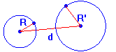
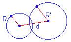
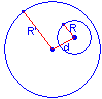
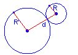
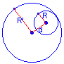
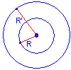

# Enunciats condicionals

## **26** El primer nombre és més gran 

**Enunciat**: Algorisme que demani dos números i indiqui si el primer és més gran que el segon.

**Nom del fitxer**: **```_26_primerMesGran.py```**

**Solució**: [**```_26_primerMesGran.py```**](./fitxers/_26_primerMesGran.py)

<hr>

## **27** És positiu?

**Enunciat**: Algorisme que demani un número i digui si és **positiu**, **negatiu**.

**Nom del fitxer**: **```_27_esPositiuONegatiu.py```**

**Solució**: [**```_27_esPositiuONegatiu.py```**](./fitxers/_27_esPositiuONegatiu.py)

<hr>

## **28** És parell o senar? 

**Enunciat**: Escriu un programa que llegeixi un número i indiqui si és parell o imparell.
	
**Nom del fitxer**: **```_28_parellOImparell.py```**

**Solució**: [**```_28_parellOImparell.py```**](./fitxers/_28_parellOImparell.py)

<hr>

## **29** Control que segon numero entrar no sigui zero

**Enunciat**: Creeu un programa que demani a l'usuari dos números i mostri la seva divisió si el segon no és zero, o un missatge d'avís en cas contrari.
	
**Nom del fitxer**: **```_29_controlaSegonEsZero.py```**

## **30** Control d'accés

**Solució**: [**```_29_controlaSegonEsZero.py```**](./fitxers/_29_controlaSegonEsZero.py)

<hr>

**Enunciat**: Escriu un programa que demani un nom d'usuari i una contrasenya i si s'ha introduït "joan" i "ginebro" s'indica "Has entrat al sistema", si no hi ha un error.
	
**Nom del fitxer**: **```_30_controlDAcces.py```**

**Solució**: [**```_30_controlDAcces.py```**](./fitxers/_30_controlDAcces.py)

<hr>

## **31** Estan en majúscules?

**Enunciat**: Programa que llegeixi una cadena per teclat i comproveu si totes les lletres estan en majúscules.
	
**Nom del fitxer**: **```_31_cadenaEnMajuscules.py```**

**Solució**: [**```_31_cadenaEnMajuscules.py```**](./fitxers/_31_cadenaEnMajuscules.py)

<hr>

## **32** Càlcul de potencia

**Enunciat**: Realitza un algorisme que calculi la potència, per això cal demanar per teclat la **base** i l'**exponent**.

Poden passar tres coses:
1. L'exponent sigui **positiu**, només heu d'imprimir la potència.
1. L'exponent sigui **```0```**, el resultat és **```1```**.
1. L'exponent sigui **negatiu**, el resultat és **1/potència amb l'exponent positiu**.
	
**Nom del fitxer**: **```_32_potencia.py```**

**Solució**: [**```_32_potencia.py```**](./fitxers/_32_potencia.py)

<hr>

## **33** Control d'entrada

**Enunciat**: Algorisme que demani dos nombres **nota** i **edat** i un caràcter **sexe** i mostrar el missatge: **ACCEPTADA** si:
1. la nota és major o igual a **cinc**,
1. l'edat és major o igual a **divuit** i
1. el sexe és **F**.

En cas que es compleixi el mateix, però el sexe sigui **M**, heu de mostrar el missatge: **POSSIBLE**.

Si no es compleixen aquestes condicions cal mostrar el missatge: **NO ACCEPTADA**.

**Nom del fitxer**: **```_33_controlEntrada.py```**

**Solució**: [**```_33_controlEntrada.py```**](./fitxers/_33_controlEntrada.py)

<hr>

> ## [TEORIA python **```try``` - ```except```**](./teoria/try-except.md) 

<hr>

**Solució**: [**```_33_controlEntrada.py```**](./fitxers/_33_controlEntrada.py)

<hr>


## **34** Ordenar tres nombres

**Enunciat**: Algorisme que demani tres números i els mostri ordenats (de major a menor)
	
**Nom del fitxer**: **```_34_ordenarTresNombres.py```**

<!-- **Solució**: [**```_34_ordenarTresNombres.py```**](./fitxers/_34_ordenarTresNombres.py) -->

<hr>

## **35** Posició relativa de dues circumferències.

**Enunciat**: Algorisme que demani els punts centrals $(x^1,y^1)$, ($x^2, y^2$) i els radis $r^1$, $r^2$ de dues circumferències i les classifiqui en un d'aquests estats:

|tipus de<br>circumferència|diagrama|
|----|:----:|
|exteriors||
|tangents exteriors||
|assecants||
|tangents interiors||
|interiors||
|concèntriques||

A la següent pàgina [POSICIÓN RELATIVA DE DOS CIRCUNFERENCIAS](http://mimosa.pntic.mec.es/clobo/geoweb/circun3.htm) podem aprendre la relació entre dues circumferències.

**Nom del fitxer**: **```_35_posicioRelativaDuesCircumferencies.py```**

<hr>

## **36** Determina el tipus de triangle.

**Enunciat**: Programa que llegeixi **```3``` dades d'entrada** **```A```**, **```B```** i **```C```**. Aquestes corresponen a les **mides dels costats d'un triangle**. El programa ha de determinar quin tipus de triangle és, tenint en compte:	

1. Si es compleix **Pitàgores** llavors és un **triangle rectangle**,
1. si **només dos costats del triangle són iguals**, aleshores és un **triangle isòsceles**.
1. Si **els 3 costats són iguals**, aleshores és un **triangle equilàter**.
1. Si **no es compleix cap de les condicions anteriors**, és un **triangle escalè**.

**Nom del fitxer**: **```_36_determinaTriangle.py```**

<!-- **Solució**: [**```_36_determinaTriangle.py```**](./fitxers/_36_determinaTriangle.py) -->

> ## [TEORIA: **Any de traspàs**](./teoria/teo-03-any-de-traspas.md)

<hr>

## **37** Determina el tipus de triangle.

**Enunciat**: Escriure un programa que llegeixi un any indicar si és de traspàs. Nota: un any és de traspàs és quan l'any és divisible per 4, però no si és divisible per 100, excepte que també sigui divisible per 400.

**Nom del fitxer**: **```_37_anyDeTraspas.py```**

<hr>

## **38** Valida la data

**Enunciat**: Escriu un programa que demani una data (dia, mes i any) i digui si és correcta.

<!-- **Nom del fitxer**: **```_38_dataCorrecta.py```** -->

<hr>

## **39** Calcul del preu dels Vinicultors

**Enunciat**: L'associació de vinicultors té com a política fixar un preu inicial al quilo de raïm, la qual es **classifica segons el tipus**:
* tipus A i
* tipus B,

i a més també la **classifica segons la mida**:

* mida 1 i
* mide 2.

Quan es fa la **venda del producte**, aquesta venda és: **d'un sol tipus i mida**, cal determinar quan rebrà un productor pel raïm que lliura en un embarcament, considerant el següent:

* si és de **tipus A** se li **carreguen** al preu inicial:
   * **```20 cèntims```** i és de **mida ```1```** i
   * **```30 cèntims```** si és de **mida ```2```**

* si és de **tipus B**, es **rebaixen** al preu inicial:
   * **```30 cèntims```** quan és de **```mida 1```**, i
   * **```50 cèntims```** quan és de **```mida 2```**.

Realitzeu un algorisme per determinar el guany obtingut.

**Nom del fitxer**: **```_39_preuVinicultors.py```**

<hr>

## **40** Càlcul del pagament EmpresaBusos

**Enunciat**: El director d'una escola organitza un viatge d'estudis i cal calcular quin és l'import que ha de cobrar a cada alumne i quant ha de pagar a la companyia de viatges pel servei.

La manera de cobrar és la següent:

* si són 100 alumnes o més, el cost per cada alumne és de 65 euros;

* si són d'entre 50 a 99 alumnes, el cost és de 70 euros,

* si són d'entre 30 a 49 alumnes, el cost és de 95 euros, i

* si són menys de 30, el cost del lloguer de l'autobús és de 4000 euros, sense importar el nombre d'alumnes.

Realitzeu un algorisme que permeti determinar el pagament a la companyia d'autobusos i el que ha de pagar cada alumne pel viatge. 

**Nom del fitxer**: **```_40_pagamentEmpresaBusos.py```**

<hr>

## **41** Cobrament d'una operadora telefònica

**Enunciat**: La política de cobrament d'una companyia telefònica és quan es fa una trucada, el cobrament és pel temps que dura, de manera que:

1. els **primers cinc minuts** costen **```1``` euro**,

1. els **tres següents**, **```80``` cèntims**,

1. els següents dos minuts, 70 cèntims, i

1. a partir del desè minut, 50 cèntims.

A més, es **carrega** un **impost de ```3%```** quan és **diumenge**, i si és un altre dia, durant el **torn de matí**, **```15%```**, i durant **el torn de tarda**, **```10%```**. 

Realitzeu un algorisme per determinar quant ha de pagar per cada concepte una persona que realitza una trucada. 

**Nom del fitxer**: **```_41_cobramentTelefonica.py```**

> **Exemple d'execució**
> 
> **Test 1**
> 
> Entra la durada de la trucada (en minuts): 1250
>
> És en diumenge (S/N): n
>
> Entra el torn Mati o Tarda (M/T): m
>
> El cost de la trucada es: 723.12 euros.
> 
> **Test 2**
> 
> Entra la durada de la trucada (en minuts): 1250
>
> És en diumenge (S/N): s
>
> El cost de la trucada es: 647.66 euros.
> 
> **Test 3**
> 
> Entra la durada de la trucada (en minuts): 1250
>
> És en diumenge (S/N): n
>
> Entra el torn Mati o Tarda (M/T): t
>
> El cost de la trucada es: 691.68 euros.

<hr>

## **42** Valor de la cara oposada d'un dau

**Enunciat**: Realitza un programa que demani per teclat el resultat (dada sencera) obtingut en llançar un dau de sis cares i mostri per pantalla el nombre en lletres (dada cadena) de la cara oposada al resultat obtingut.

**Nota 1**: A les cares oposades d'un dau de sis cares hi ha els números:

* **```1```** - **```6```**,
* **```2```** - **```5```** i
* **```3```** - **```4```**.

**Nota 2**: Si el número del dau introduït és **menor que ```1```** o **major que ```6```**, es mostrarà el missatge: 
**```ERROR: número incorrecte.	```**

**Nom del fitxer**: **```_42_nombreOposatDau.py```**

<hr>

## **43** Dies de la setmana

**Enunciat**: Realitza un programa que demani el dia de la setmana (de l'**```1```** al **```7```**) i torni el nom del dia corresponent. Si introduïm un altre número ens dóna un error.

**Nom del fitxer**: **```_43_diesDeLaSetmana.py```**

<hr>

## **44** Torna la quantitat de dies d'un mes

**Enunciat**: Escriviu un programa que demani un nombre enter entre un i dotze i imprimeixi el nombre de dies que té el mes corresponent. Si introduïm un altre número ens dóna un error.

**Nom del fitxer**: **```_44_diesQueTeUnMes.py```**

<hr>

## **45** Empresa de paquets

**Enunciat**: Una companyia de transport internacional té servei a alguns països:

* pais d'Amèrica del Nord (**```24``` euros/kilo**),

* pais d'Amèrica Central (**```20``` euros/kilo**),

* pais d'Amèrica del Sud (**```21``` euros/kilo**),

* pais d'Europa (**```10``` euros/kilo**) i

* pais d'Àsia (**```18``` euros/kilo**).

El **cost** pel servei de transport es basa en el **pes del paquet** i la **zona a què va dirigit**.  

**Nom del fitxer**: **```_45_empresaPaquets.py```**

