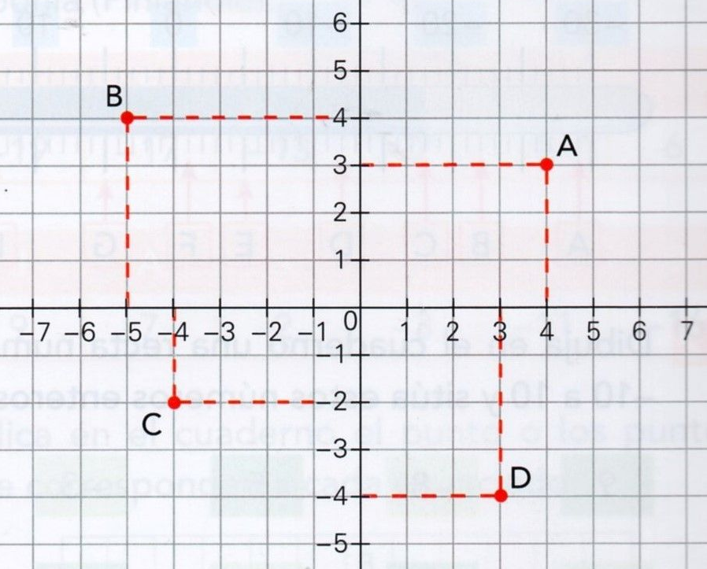
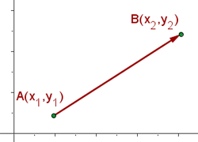

# TEORIA: **Sistema de coordenades cartesianes**

[Sistema de coordenades cartesianes (wikipedia.org)](https://ca.wikipedia.org/wiki/Sistema_de_coordenades_cartesianes)

En matemàtiques, el **sistema de coordenades cartesianes** (anomenat també **sistema de coordenades rectangulars**) es fa servir per a determinar unívocament cada **punt del pla** a través de **dos nombres reals** anomenats habitualment la **coordenada X** o **coordenada de les abscisses** i la **coordenada Y** o **ordenada del punt**.

Per a definir les coordenades d'un punt qualsevol, cal especificar prèviament diversos elements.

**1.** En primer lloc, es fixa un punt del pla, dit **origen de coordenades**

**2.** Tot seguit es prenen dues rectes perpendiculars (**coordenada de l'eix x** o **coordenada de l'eix d'abscisses**, i l'**coordenada de eix y** o **coordenada de eix d'ordenades**) que es **creuen** a l'origen, i a cada una de les quals s'assigna una direcció considerada positiva o creixent.

**3.** I finalment cal especificar una **unitat de longitud**, que es marca sobre els **dos eixos** (vegeu figura).

Els sistemes de coordenades cartesianes s'estenen de manera anàloga a l'espai de tres dimensions i a espais de dimensions superiors.



A la figura s'ha assenyalat el punt **```A```** amb coordenada x (o abscissa) igual a **```4```** i amb coordenada y (o ordenada) igual a **```3```**, és a dir el punt **```(4,3)```**

|Punt|X|Y|Punt(X,Y)|
|:---:|---:|---:|:---|
|**```A```**|**```4```**|**```3```**|**```A( 4, 3)```**|
|**```B```**|**```-5```**|**```4```**|**```B(-5, 4)```**|
|**```C```**|**```-4```**|**```-2```**|**```C(-4,-2)```**|
|**```D```**|**```3```**|**```-4```**|**```D( 3,-4)```**|


](../
$$h2 = (x_2-x_1)^2 + (y_2 - y_1)^2$$

$$h = \sqrt{(x_2-x_1)^2 + (y_2 - y_1)^2}$$

$$d(A,B) = \sqrt{(x_2-x_1)^2 + (y_2 - y_1)^2}$$


A la figura s'ha marcat:





|Punt|X|Y|Punt(X,Y)|
|:---:|---:|---:|:---|
|**```A```**|**```3```**|**```2```**|**```A(3,2)```**|
|**```B```**|**```7```**|**```8```**|**```B(7,8)```**|

Per tant, la distància entre el punt A i el punt B és:

$$d(A,B) = \sqrt{(x_2 - x_1)^2 + (y_2 - y_1)^2}$$

$$d(A,B) = \sqrt{(8 - 2)^2 + (7 - 3)^2} = \sqrt{(6)^2 + (4)^2} = \sqrt{36 + 16} = \sqrt{52} = 7,211102551$$

$$d(A,B)= 7,21$$
