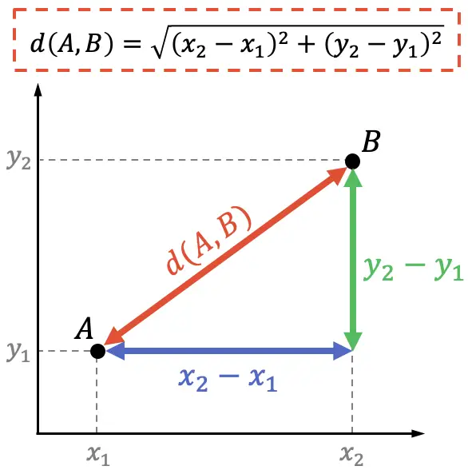

# TEORIA: **Distància**

Es denomina distància entre dos punts $A=$ ($x_1,y_1$) i $B=$($x_2,y_2$) a la longitud del segment que uneix **$A$** i **$B$**.

S'expressa matemàticament com:

$$h^2 = (x_2-x_1)^2 + (y_2 - y_1)^2$$

$$h = \sqrt{(x_2-x_1)^2 + (y_2 - y_1)^2}$$

$$d(A,B) = \sqrt{(x_2-x_1)^2 + (y_2 - y_1)^2}$$
