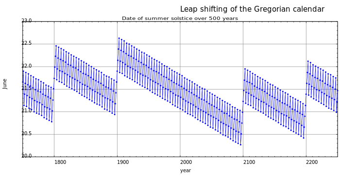

# TEORIA: **Any de traspàs**

[Sistema de coordenades cartesianes (wikipedia.org)](https://ca.wikipedia.org/wiki/Sistema_de_coordenades_cartesianes)

Un **any de traspàs**, **any bixest**  o **any bissextil** és un any civil que té un dia més que els anys comuns, és a dir, té **```366``` dies**.

El dia de més s'afegeix al final del mes que era el darrer del calendari romà: el **febrer**, de tal manera que aquest mes passa a tenir **```29``` dies**. Aquest dia s'anomenà **Bisextus calendas martii**, ja que s'afegí darrere del **sextus calendas martii**, d'aquí el seu nom.

El repartiment dels anys civils en anys comuns i de traspàs es fa d'acord amb el calendari gregorià:
1. en cada període de **```400``` anys** n'hi ha **303 de comuns** i **97 de traspàs**.

S'alternen de la següent manera: són de traspàs els anys en què les dues darreres xifres de l'any són múltiples de 4, excepte si aquestes xifres són 00. Aleshores, cal tenir en compte les dues primeres xifres de l'any. Si són múltiples de 4, l'any també serà de traspàs.

Per exemple:

* el **```1996```** va ser **de traspàs**, perquè:
    * **96 és múltiple de ```4```**;

* el **```1900```**, **no fou de traspàs**, perquè:
    * **```19``` no és múltiple de ```4```**, però

* el **```2000```** va ser **de traspàs**, perquè:
    * les dues darreres xifres també eren **```00```** i calia tenir en compte el **```20```**.
    * Com que **```20``` és múltiple de ```4```**.

**En resum**: és de traspàs cada **any múltiple de quatre**, excepte els **múltiples de cent**, que **no ho són**, i excepte els **múltiples de 400**, que **sí que ho són**.

L'**any de traspàs** també s'anomena **bixest** o **bissextil**, mots que fan referència al dia ***bis-sextus pridie Martias Kalendas***, és a dir, al ***dia que s'intercalava entre el sextus i el quintus de les calendes de març***, al final de febrer, en la proposta ***juliana*** inicial.

Per això es diu **dia intercalar**. També existeix una etimologia popular que fa derivar la paraula **bixest** del fet que el nombre de dies que té (**```366```**) acaba en **dos sisos**.




Com que s'afegeix per corregir el desfasament que hi ha entre la durada de l'any tròpic: **```365``` dies ```5``` h ```48``` min ```45,10``` s** (**```365,242189``` dies**) i l'any calendari de **```365``` dies**. Això requereix que cada quatre anys es corregeixi l'any calendari per una acumulació no comptabilitzada d'un **```1/4``` de dia per any** que equival a un dia extra.

## Algorisme computacional

Un any és de traspàs si és:
* Divisible entre 4.
* Divisible entre 400.

L'any **```2000```** i **```2400```** són de traspàs doncs encara sent **divisibles entre ```100```** ho són també **entre ```400```**. Però els anys **```1900```, ```2100```, ```2200``` i ```2300```** no ho són perquè només són **divisibles entre ```100```**.

Des d'un enfocament algorítmic, es consideren les proposicions o enunciats lògics següents:

```
p: És divisible entre 4
q: És divisible entre 100 (¬q llavors significa no divisible entre 100)
r: És divisible entre 400
```

